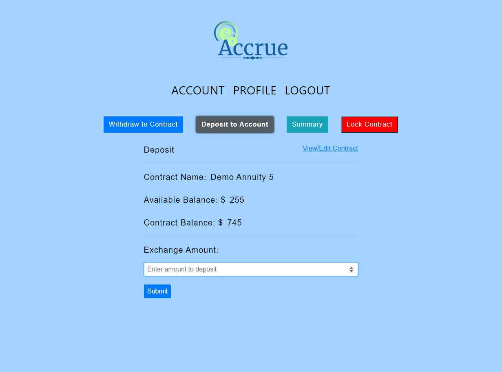
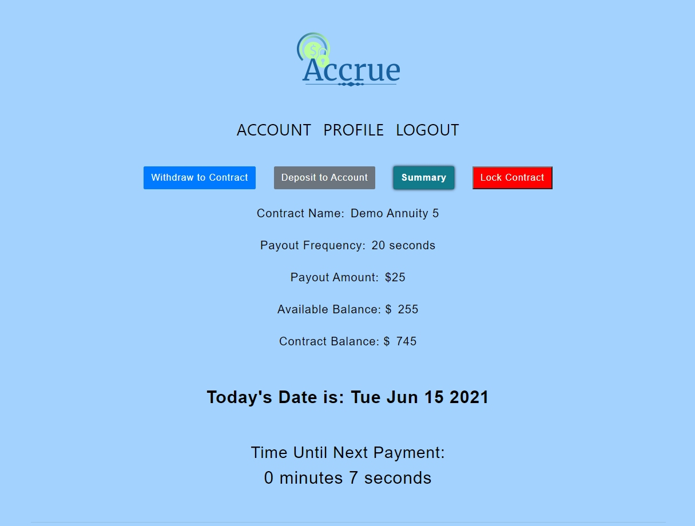

# Accrue Annuity Web App

### Overview
This app is a proof of concept fixed-income product using js React, Redux & PostgresSQL. The MVP for this product will be as follows; the user will be able to customize their contract, expand their interest-bearing position at the buy-in period and receive fixed-income payments when the contract is locked during the annuitization period. The dashboard displays only pertinent information relating to the user's investment including contract details, current interest rate offered, next payout amount & date, how much total payout is remaining, etc.  The user will find the app easy to use, providing only a few focused areas to engage the contract. This project was an inspiration from a financial product called a period-certain annuity.

### Features
User Login: Users will create an account and log in to the application. Each user will have a unique account page containing their contract.

Lock-in Money: The user will have the ability to deposit money to be vested for a user-specified time period.

Recieve Money: The user will recieve their payout routinely, at the user's specification, until funds are exhausted from the contract.

Specify Contract Specs: User will be able to specify the name of the contract, the payout frequency and amount of each payout.

### Preview

### How to Run

<ul>
    <li>Run PostgreSQL & setup connection details in server/db/connect.js</li>
    <li>Execute SQL scripts, server/scripts.sql</li>
    <li>cd server/</li>
    <li>yarn install</li>
    <li>yarn start</li>
    <li>cd ../</li>
    <li>yarn install</li>
    <li>yarn start</li>
</ul>

### Dependencies

yarn add
axios@0.19.2
bootstrap@4.4.1
history@4.10.1
jwt-decode@2.2.0
lodash@4.17.15
moment@2.25.3
node-sass@4.14.1
react-bootstrap@1.0.1
react-redux@7.2.0
react-router-dom@5.1.2
redux@4.0.5
redux-thunk@2.3.0

### Server Dependencies

axios@0.19.2 
bcryptjs@2.4.3 
cors@2.8.5 
dotenv@8.2.0 
express@4.17.1 
jsonwebtoken@8.5.1 
moment@2.25.3 
pg@8.0.3 
nodemon@2.0.4

### Notes

*There are some unresolved dependency issues between node-sass, node-gyp, node.js and python. This app will be refactored using sass in the future. The current workaround is to have the following versions of these dependencies installed...
Node.js version 15.9.0, node-gyp -v 7.1.2, python 3.9, and node-sass v4.14.1.

